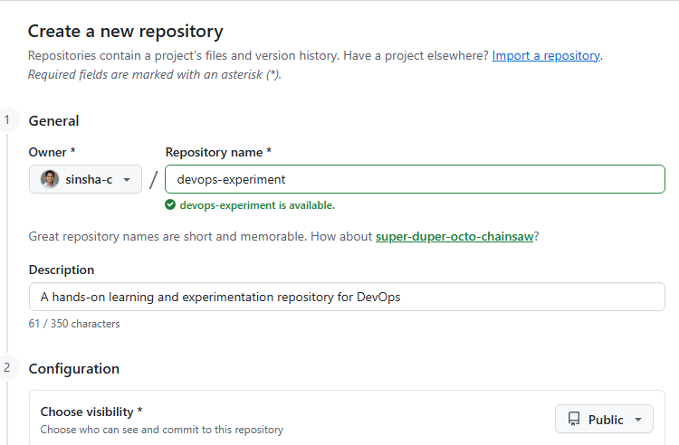
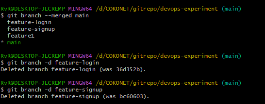
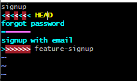
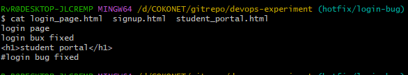
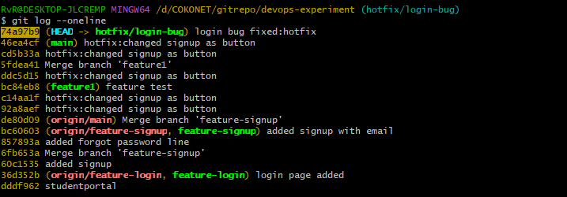
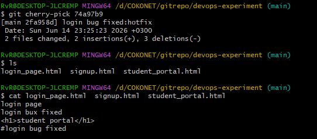
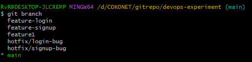
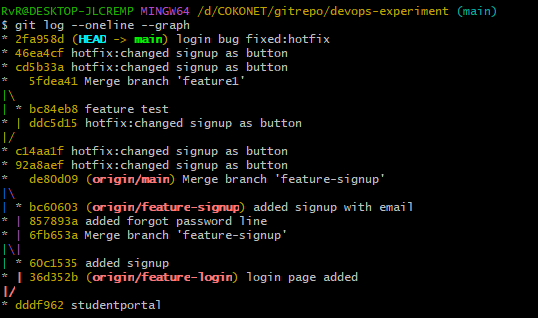

**Scenario** 

You are working as a DevOps Engineer in a company called **ABC Technologies**. The development team is building a simple website called **Student Portal**. 

Different developers work on different features using Git branches. Your task is to manage branches, merge changes, resolve conflicts, and use cherry-pick when required. 

**Task 1: Create Repository**

- Login to github and create a new repository



- Go to the terminal where the git is configured already.  
```bash
git clone <repourl>  
cd <reponame>  
nano student_portal.html  
<h1>student portal</h1>  
git add .  
git commit -m “studentportal”  
git push origin main
```
OR 

Go to the terminal, create a new directory and initialize Git. 
```bash
mkdir devops-experiment  
git init   
nano student_portal.html  
<h1>student portal</h1>  
git add .  
git commit -m “studentportal”  
git remote add origin URL (copy the github repo url from github which already created above)
git push origin main
```

**Task 2: Create Feature Branch** 

Management wants a login page. Create a branch and working in it 

```bash
git checkout -b feature-login
``` 
- Add one file and commit



**Task 3: Create Another Feature Branch** Switch to main and Create another branch also continue work on it 
```bash
git checkout main  
git checkout -b feature-signup  
```
- Add some content to signup.html
```bash
git add .  
git commit -m “added signup”
```
**Task 4: Merge Feature Branch** Merge feature into main. 
```bash
git checkout main  
git merge feature-login  
git merge feature-signup
```

**Task 5: Create Merge Conflict** 

Now simulate two developers modifying the same line. 

From command line open a file (signup.html) and added one line at the end  
```bash
git add .
git commit -m "forgot password" 
git checkout feature-signup  
```
Added another line at the end of same file  
```bash
git add .
git commit -m "signup with email" 
```bash
git checkout main  
git merge feature-signup
``` 

❌Below message will throw as error
```bash
CONFLICT (content): Merge conflict in signup.html
Automatic merge failed; fix conflicts and then commit the result.
```
**Task 6: Resolve Merge Conflict**  
Try merging: 
- Open signup.html and remove markers and keep only the desired line  

``bash
git add signup.html  
git commit -m “added signup with email”  
```
Your branch now merged
```bash
  [main de80d09] Merge branch 'feature-signup'
```
To add the branch remotely  
```bash
  git push origin feature-login  
  git push origin feature-signup
```
**Task 7: Create Hotfix Branch** 

Production issue found. Create hotfix branch and work on it 
```bash
git checkout  main  
git checkout -b hotfix/login-bug
``` 
Changed all the file
```bash  
git add .  
git commit -m "login bug fixed:hotfix"
```
 

**Task 8: Cherry Pick Commit** Management wants only the hotfix commit in main. 
```bash  
- git log --oneline
``` 
Copy the commit id of the hotfix commit  
 
```bash
git checkout main  
git cherry-pick <commit-id>  
```
Check the file. You can see only the cherrypiked commit has come in the main branch file



**Task 9: Delete Merged Branches** 

List branches and list merged branches:
```bash
git branch
git branch --merged main  
```
Delete merged branch:   
```bash
git branch -d feature-login
```


**Task 10: Verify Final Repository** 
Display graph:  
```bash
git log --oneline --graph
```


